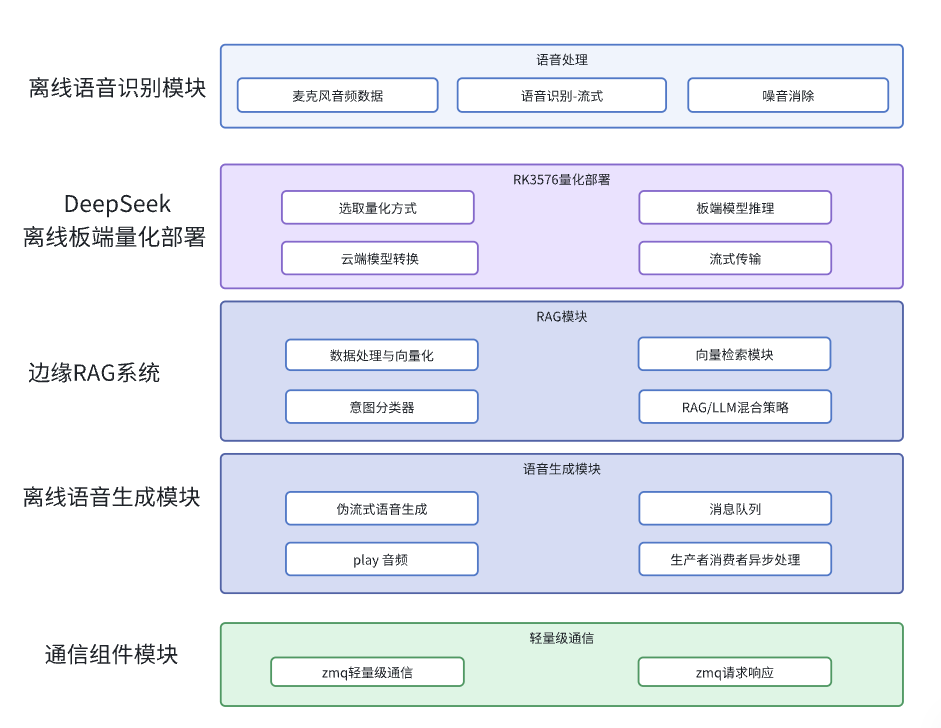

# 端侧部署C++项目-全离线边缘端侧-座舱RAG知识库-LLM离线智能语音交互系统

## 适用岗位：机器人/自动驾驶开发岗位，C++任意开发岗位，嵌入式AI相关需求岗位

## 项目视频文档解析
**添加微信**：auto_drive_yue

## 项目概述

本项目开发了一套 **​边缘端侧设备 - 全离线、模块化​​的座舱知识库-智能语音交互系统**，基于 RK3576 实现完整的**端到端语音交互流水线**。集成了四大核心模块：​**​座舱RAG知识检索+多级响应策略​**​、​**​流式语音识别(ASR)​**​、**​​DeepSeek 大模型推理​** ​和 **​​双缓冲队列语音合成(TTS)**​​，通过​​标准化ZeroMQ通信接口​​实现松耦合架构。在端侧边缘环境下，设计**多级响应策略**，针对不同类型的查询需求提供**最优响应方案**。

## 项目技术栈
**技术栈**：Linux、C++、RAG知识库、ASR、RK芯片云端量化/端侧部署、TTS、ZeroMQ、CMake、多线程

## 项目架构
 

## 核心特性

- 🚀 **全离线部署**：不依赖云端服务，基于RK3576 NPU实现本地化推理
- 🔧 **模块化架构**：RAG/ASR/TTS/LLM模块通过ZeroMQ松耦合通信
- ⚡ **低延迟优化**：流式ASR + 双缓冲TTS队列实现快速响应

